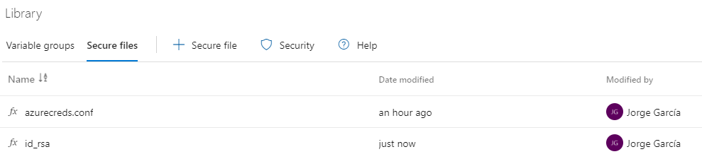
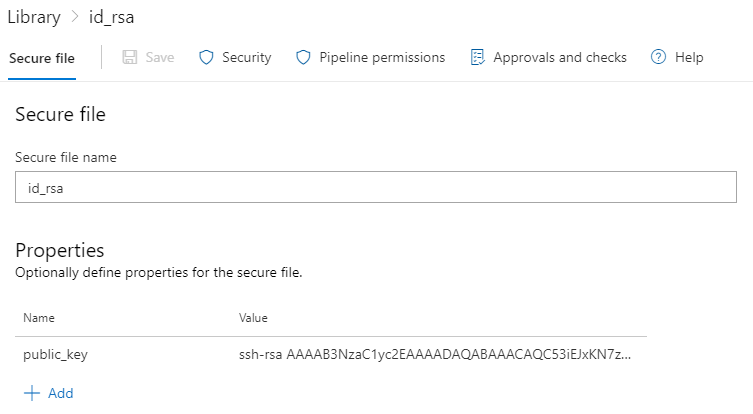
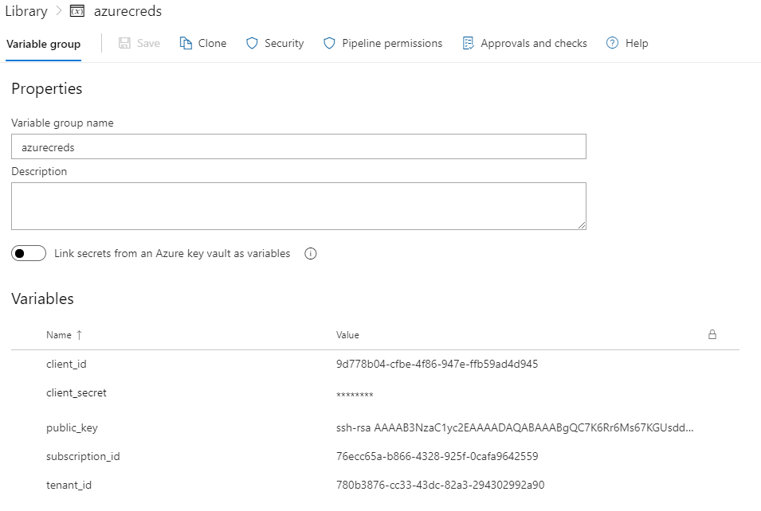
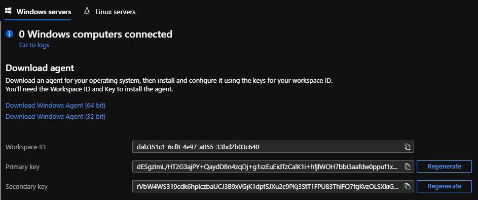

# Udacity Cloud DevOps using Microsoft Azure Nanodegree Program Capstone Project: Ensuring Quality Releases

## Table of Contents
* [Introduction](#Introduction)
* [Getting Started](#Getting-Started)
* [Install our dependencies](#Install-our-dependencies)
* [Configure storage account and state backend for Terraform](#Configure-storage-account-and-state-backend-for-Terraform)
* [Create a Service Principal for Terraform](#Create-a-Service-Principal-for-Terraform)
* [Create a Selenium test for a website](#Create-a-Selenium-test-for-a-website)
* [Configure an Azure Log Analytics Workspace](#Configure-an-azure-log-analytics-workspace)
* [References](#References)

## Introduction
This is the capstone project for the Udacity Cloud DevOps using Microsoft Azure Nanodegree Program, in this project we create disposable test environments and run a variety of automated tests with the click of a button. Additionally, we monitor and provide insight into an application's behavior, and determine root causes by querying the application’s custom log files.

For this project we use the following tools:

- Azure DevOps: For creating a CI/CD pipeline to run Terraform scripts and execute tests with Selenium, Postman and Jmeter
- Terraform: For creating Azure infrastructure as code (IaS)
- Postman: For creating a regression test suite and publish the results to Azure Pipelines.
- Selenium: For creating a UI test suite for a website.
- JMeter: For creating a Stress Test Suite and an Endurance Test Suite.
- Azure Monitor: For configuring alerts to trigger given a condition from an App Service.

## Getting Started
For this project we will follow the next steps:
1. Install our dependencies
2. Configure storage account and state backend for Terraform
3. Create a Service Principal for Terraform
- Use Terraform.
- Configure Azure Monitor.
- Configure Azure Log Analytics.

## Install our dependencies
For the successful run of this project we need to do the following prework:
1. Install Visual Studio Code: https://code.visualstudio.com/
2. Create an Outlook Account: https://outlook.live.com/
3. Create a free Azure Account: https://azure.microsoft.com/
4. Create an Azure Devops account: https://azure.microsoft.com/services/devops/
5. Install Azure CLI: https://docs.microsoft.com/cli/azure/install-azure-cli?view=azure-cli-latest
6. Install Terraform: https://learn.hashicorp.com/tutorials/terraform/install-cli#install-terraform
7. Install the Java Development Kit: https://www.oracle.com/java/technologies/javase/javase-jdk8-downloads.html
8. Install JMeter: https://jmeter.apache.org/download_jmeter.cgi
9. Install Postman: https://www.postman.com/downloads/
10. Install Python: https://www.python.org/downloads/
11. Install Selenium for Python: https://pypi.org/project/selenium/
12. Install Chromedriver: https://sites.google.com/a/chromium.org/chromedriver/downloads

## Configure storage account and state backend for Terraform
Terraform state is used to reconcile deployed resources with Terraform configurations. State allows Terraform to know what Azure resources to add, update, or delete. By default, Terraform state is stored locally when you run the terraform ```apply``` command. This configuration isn't ideal for the following reasons:

Local state doesn't work well in a team or collaborative environment.
Terraform state can include sensitive information.
Storing state locally increases the chance of inadvertent deletion.
Terraform supports the persisting of state in remote storage. One such supported back end is Azure Storage. This document shows how to configure and use Azure Storage for this purpose.

For the project we will use Azure Storage for persisting the Terraform state in remote storage. For this we will run the ```terraformconfig.sh``` file, which has the necessary configuration files for creating a blob storage to store the state.

First, we have to ensure we are logged in into Azure CLI by running the following command:
```Bash
az login
```

Once that's done, we can run the ```terraformconfig.sh``` file with the following command:
```Bash
sh terraformconfig.sh
```

We will get 3 outputs:
- storage_account_name
- container_name 
- access_key

We will use this fields, plus a ```key``` field we will define as ```test.terraform.tfstate```

we will store this 4 values on a file named ```azurecreds.conf``` and in a ```.gitignore``` file we will write the file name so that it isn't stored in our repository.

```
In the ```main.tf``` in the ```environments\test``` directory input the following fields:
```Bash
terraform {
  backend "azurerm" {
    storage_account_name = ""
    container_name       = ""
    key                  = ""
    access_key           = ""
  }
}
```

## Create a Service Principal for Terraform
In the ```main.tf``` file we need the following data:
- tenant_id
- subscription_id
- client_id
- client_secret

For this we have to obtain our subscription_id with the followging command:

```Bash
az account show
```

Copy the "id" field. Now it is time to create the service principal, input the following command:

```Bash
az ad sp create-for-rbac --role="Contributor" --scopes="/subscriptions/your-subscription-id"
```

We will get an output similar to this:
```Bash
{
  "appId": "00000000-0000-0000-0000-000000000000",
  "displayName": "azure-cli-2017-06-05-10-41-15",
  "name": "9d778b04-cfbe-4f86-947e-000000000000",
  "password": "0000-0000-0000-0000-000000000000",
  "tenant": "00000000-0000-0000-0000-000000000000"
}
```

These values map to the Terraform variables like so:

- appId is the client_id defined above.
- password is the client_secret defined above.
- tenant is the tenant_id defined above.

We will add this values to our ```azurecreds.conf``` file, so at the end we will have data similar to this in our conf file:
```Bash
subscription_id = "12345678-b866-4328-925f-123456789"
client_id = "00000000-0000-0000-0000-000000000000"
client_secret = "0000-0000-0000-0000-000000000000"
tenant_id = "00000000-0000-0000-0000-000000000000"

storage_account_name = "tstate12345"
container_name = "tstate"
key = "test.terraform.tfstate"
access_key = "qwewqeDddsad13334324asdd7IuD4RK21jNFWq4XUwAQyYtxxneepnXxLWk49OYvTEoPydmRclPEwSBRrrreqr=="
```

We are now ready to configure an Azure DevOps Pipeline.

## Configure Azure Pipelines
We will need to install Terraform extension from Microsoft DevLabs to use terraform in our DevOps Project, install it from the following URL: https://marketplace.visualstudio.com/items?itemName=ms-devlabs.custom-terraform-tasks

Now we need to create a new Service Connection in the Project by going to Project Settings -> Service connections -> New service connection -> Azure Resource Manager -> Service Principal (Manual) -> Choose the subscription -> Fill the data from your azurecreds.conf file -> Name the new service connection to Azure Resource Manager as ```azurerm-sc```.
This service connection will be used in the ```azure-pipelines.yml``` file.

The next step is to upload our ```azurecreds.conf``` to Azure Devops as a Secure File, to do this we have to navigate to Pipelines -> Library -> Secure Files -> + Secure File -> Upload File. Now the file should be uploaded.

Further ahead when the pipeline is created, remember to go into the "Pipeline permissions" menu by clicking in the file name in the "Secure Files" menu and add add the pipeline that we will be using.

To access the VM that Terraform creates we will need to also upload to Secure Files a private key.

To create the private key, please follow the official documentation from Microsoft at https://docs.microsoft.com/en-us/azure/devops/pipelines/tasks/utility/install-ssh-key?view=azure-devops

Save the public key in a variable group.

Our secure files should look something like this, in this case the private key is named id_rsa.


And our Private Key Secure File Properties should look like this.


We will also need a variables group, we will add the following data in a variable group named ```azurecreds```:
- client_id: 'your-client-id'
- client_secret: 'your-client-secret' (click on the lock to change it to a secret variable)
- subscription_id: 'your-subscription-id'
- tenant_id: 'your-tenant-id'
- public_key: 'your-public-key'



We are ready to run the Provision stage of our pipeline.

## Create a Selenium test for a website
For the next part of the project we will explain our tests that can be found on the selenium-test.py file.

First we have to create our tests and later configure them to run in "headless" mode, if you are running the file on a pc, comment this lines in the ```selenium-test.py``` file:
```Python
options = ChromeOptions()
options.add_argument("--headless") 
driver = webdriver.Chrome(options=options)
```

## Configure an Azure Log Analytics Workspace
To run the Deploy stage of our pipeline we must configure an Azure Log Analytics Workspace before running the Deploy Virtual Machine task. To do this run the ```setup-log-analytics.sh``` file in the deployments directory, modify as needed and refer to the official Microsoft documentation if needed: https://docs.microsoft.com/en-us/azure/azure-monitor/logs/quick-create-workspace-cli

After that, navigate to the Azure Portal, go to the resource group where the Workspace was created, click on the resource and navigate to Settings -> Agents Management.



Copy both the Workspace ID and the Primary Key, save both values in the variable group that we previously created. We will save them as la_workspace_id and la_primary_key, respectively. We can save the Primary Key by making the value secure.

We are ready to run the Deploy stage of the pipeline!


## References
- [Udacity Project Starter Files](https://video.udacity-data.com/topher/2020/June/5ed815bf_project-starter-resources/project-starter-resources.zip)
- [Visual Studio Code](https://code.visualstudio.com/)
- [Outlook](https://outlook.live.com/)
- [Azure](https://azure.microsoft.com/)
- [Azure DevOps](https://azure.microsoft.com/services/devops/)
- [Azure Command Line Interface](https://docs.microsoft.com/cli/azure/install-azure-cli?view=azure-cli-latest)
- [Terraform](https://learn.hashicorp.com/tutorials/terraform/install-cli#install-terraform)
- [Terraform Azure Documentation](https://learn.hashicorp.com/collections/terraform/azure-get-started)
- [Java Development Kit](https://www.oracle.com/java/technologies/javase/javase-jdk8-downloads.html)
- [Jmeter](https://jmeter.apache.org/download_jmeter.cgi)
- [Postman](https://www.postman.com/downloads/)
- [Python](https://www.python.org/downloads/)
- [Selenium for Python](https://pypi.org/project/selenium/)
- [Chromedriver](https://sites.google.com/a/chromium.org/chromedriver/downloads)
- [Tutorial: Store Terraform state in Azure Storage](https://docs.microsoft.com/en-us/azure/developer/terraform/store-state-in-azure-storage)
- [Get subscription id with Azure CLI](https://yourazurecoach.com/2020/07/14/get-subscription-id-with-azure-cli/)
- [Azure Provider: Authenticating using a Service Principal with a Client Secret](https://registry.terraform.io/providers/hashicorp/azurerm/latest/docs/guides/service_principal_client_secret)
- [Terraform - Microsoft DevLabs](https://marketplace.visualstudio.com/items?itemName=ms-devlabs.custom-terraform-tasks)
- [Install SSH Key Task](https://docs.microsoft.com/en-us/azure/devops/pipelines/tasks/utility/install-ssh-key?view=azure-devops)
- [Azure CLI Authentication does not work when using the Azure CLI task from Azure DevOps](https://github.com/terraform-providers/terraform-provider-azurerm/issues/3814)
- [Resources in YAML](https://docs.microsoft.com/en-us/azure/devops/pipelines/process/resources?view=azure-devops&tabs=schema)
- [Terraform on Azure Pipelines Best Practices](https://julie.io/writing/terraform-on-azure-pipelines-best-practices/)
- [Use secure files](https://docs.microsoft.com/en-us/azure/devops/pipelines/library/secure-files?view=azure-devops)
- [Create a Log Analytics workspace with Azure CLI 2.0](https://docs.microsoft.com/en-us/azure/azure-monitor/logs/quick-create-workspace-cli)
- [Install Log Analytics agent on Linux computers](https://docs.microsoft.com/en-us/azure/azure-monitor/agents/agent-linux)